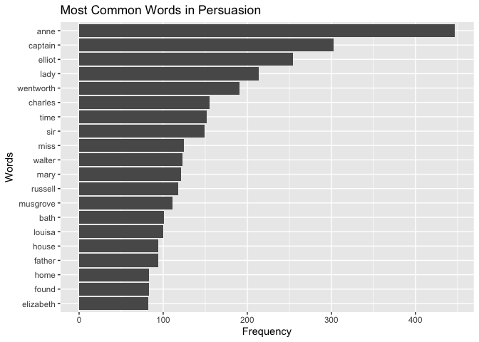

AssignmentB-4
================
Chang Liu
2023-12-05

# Import libraries

``` r
library(janeaustenr)
library(stringr)
library(tidytext)
library(stopwords)
library(ggplot2)
library(testthat)
suppressPackageStartupMessages(library(devtools))
suppressPackageStartupMessages(library(here))
suppressPackageStartupMessages(library(tidyverse))
suppressPackageStartupMessages(library(dplyr))
```

# Check the availabe data in Package

``` r
books <- austen_books();
glimpse(books)
```

    ## Rows: 73,422
    ## Columns: 2
    ## $ text <chr> "SENSE AND SENSIBILITY", "", "by Jane Austen", "", "(1811)", "", …
    ## $ book <fct> Sense & Sensibility, Sense & Sensibility, Sense & Sensibility, Se…

``` r
unique(books$book)
```

    ## [1] Sense & Sensibility Pride & Prejudice   Mansfield Park     
    ## [4] Emma                Northanger Abbey    Persuasion         
    ## 6 Levels: Sense & Sensibility Pride & Prejudice Mansfield Park ... Persuasion

# Exercise1

## I will choose the book Persuasion and display the most frequent words.

``` r
Persuasion_rows <- subset(books,book=='Persuasion');

# Split rows into single words
Persuasion_words <- Persuasion_rows %>%
  unnest_tokens(word, text) 

# using anti_join, get rid of stop_words
data("stop_words")
Persuasion_words <- Persuasion_words %>% 
  anti_join(stop_words, by = "word")

# count and sort the frequency
word_counts <- Persuasion_words %>%
  count(word, sort = TRUE)

# print the top 20 frequent words
word_counts %>%
  top_n(20, n) %>% 
  ggplot(aes(x = reorder(word, n), y = n)) +
  geom_col() +
  coord_flip() +
  labs(title = "Most Common Words in Persuasion", x = "Words", y = "Frequency")
```

<!-- -->

# Exercise2:

#### I created function pig_latin_custom. When the first character is vowels, i will put the last character of word at the front. if not, i will put the first character at the end. After the switch, i will add “abc” at the end.

``` r
#' Custom Pig Latin Function
#'
#' This function converts words to a custom version of Pig Latin. The specific rules for conversion are:
#' - For words beginning with a consonant, the first letter is moved to the end of the word.
#' - For words beginning with a vowel, the last letter is moved to the beginning of the word.
#' After rearrangement, "abc" is added to the end of the word.
#'
#' @param word A character string representing the word to be converted.
#' @return A character string representing the word converted to custom Pig Latin.
#' @examples
#' pig_latin_custom("hello") # returns "ellohabc"
#' pig_latin_custom("apple") # returns "eapplabc"
#' @export
#' 
#'


pig_latin_custom <- function(word) {
  #check type
  if (!is.character(word)) {
    stop("Input must be a character string.")
  }
  #check length
  if (nchar(word) == 0) {
    stop("Input string cannot be empty.")
  }

  vowels <- c("a", "e", "i", "o", "u", "A", "E", "I", "O", "U")

  if (substr(word, 1, 1) %in% vowels) {
    word <- paste0(substr(word, nchar(word), nchar(word)), substr(word, 1, nchar(word)-1))
  } else {
    word <- paste0(substr(word, 2, nchar(word)), substr(word, 1, 1))
  }

  word <- paste0(word, "abc")

  return(word)
}


pig_latin_custom("hello") # "ellohabc"
```

    ## [1] "ellohabc"

``` r
pig_latin_custom("apple") # "eapplabc"
```

    ## [1] "eapplabc"

``` r
# Tests

test_that("function works as expected", {
  expect_equal(pig_latin_custom("hello"), "ellohabc")
  expect_equal(pig_latin_custom("apple"), "eapplabc")
  expect_equal(pig_latin_custom("banana"), "ananababc")
})
```

    ## Test passed 🥳

``` r
test_that("function checks input as expected", {
  expect_error(pig_latin_custom(""), "Input string cannot be empty.")
  expect_error(pig_latin_custom(1111), "Input must be a character string.")
})
```

    ## Test passed 🎉
